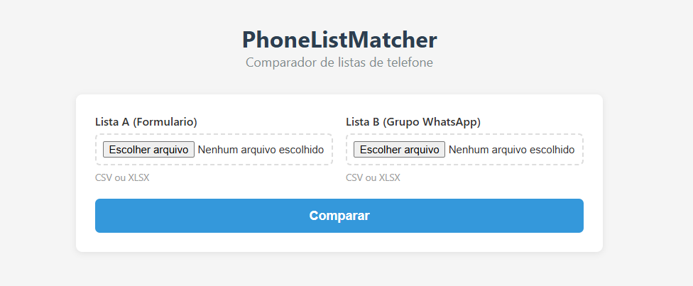
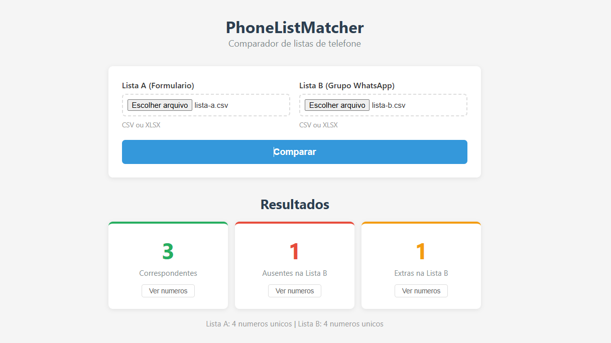

# PhoneListMatcher

Ferramenta web para comparar listas de números de telefone em diferentes formatos.

<!--  -->



---

## Problema

Dadas duas listas:

* **Lista A**: Inscritos em formulário ou lista de inscrição
* **Lista B**: Contatos extraídos de um grupo de WhatsApp usando a extensão [WA Contacts Extractor](https://chromewebstore.google.com/detail/wa-contacts-extractor)

Os números podem estar em formatos diferentes, o que impede uma comparação direta.

---

## Solução

Normaliza e compara números de telefone de forma consistente:

* Remove código do país e caracteres especiais
* Padroniza o formato
* Compara usando DDD + últimos 8 dígitos

---

## Funcionalidades

* Interface web com upload de arquivos CSV/XLSX
* Normalização automática de números
* Comparação entre listas
* Identificação de:
  * correspondentes
  * ausentes na lista B
  * extras na lista B

---

## Setup

```bash
git clone https://github.com/Helenyukari/phonelistmatcher.git
cd phonelistmatcher
npm install
```

---

## Uso

```bash
npm start
```

Acesse `http://localhost:3000` no navegador, faça upload dos dois arquivos e clique **Comparar**.

---

## Exemplo

> Os números utilizados nos exemplos são fictícios.

### Entrada

Lista A (formulário):

```
(67) 99305-5801
+55 67 99803-2171
```

Lista B (grupo WhatsApp):

```
67993055801
67998032171
```

### Saída

```
Correspondentes: 2
Ausentes: 0
Extras: 0
```

---

## Como funciona

```
1. Upload de dois arquivos CSV ou XLSX
2. Remove caracteres não numéricos
3. Remove código do país (55)
4. Padroniza para DDD + número
5. Compara pelos últimos 8 dígitos
6. Exibe resultados na interface
```

---

## Estrutura do projeto

```
.
├── index.js            # Servidor Express
├── src/
│   ├── normalizer.js   # Normalização de telefones
│   ├── parser.js       # Parsing de CSV/XLSX
│   └── comparator.js   # Comparação entre listas
├── public/
│   ├── index.html      # Interface web
│   ├── style.css       # Estilos
│   └── app.js          # JavaScript do frontend
├── examples/
│   ├── lista-a.csv     # Exemplo lista A
│   └── lista-b.csv     # Exemplo lista B
└── package.json
```

---

## Stack

* **Backend**: Express.js + Multer + SheetJS (xlsx)
* **Frontend**: HTML/CSS/JS puro

---

## Contribuição

Pull requests são bem-vindos.

---

## Licença

MIT
